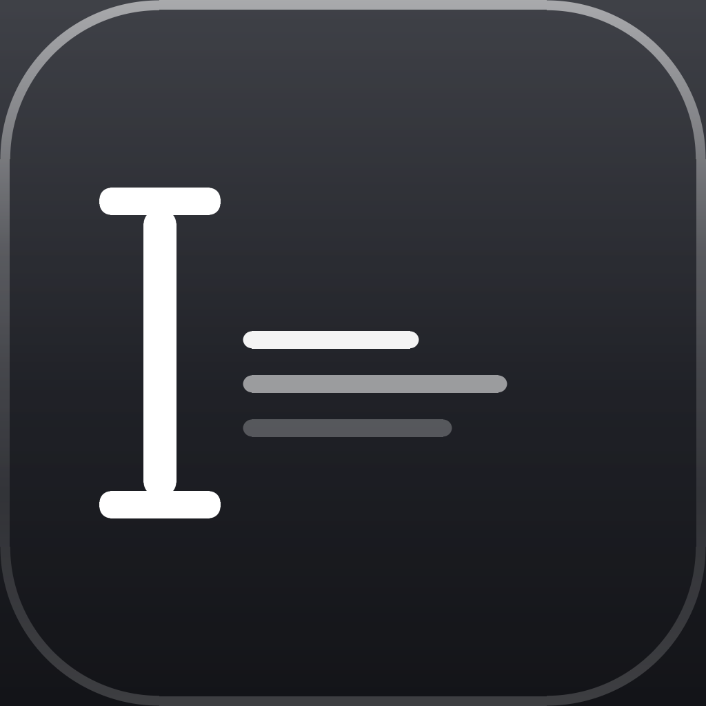
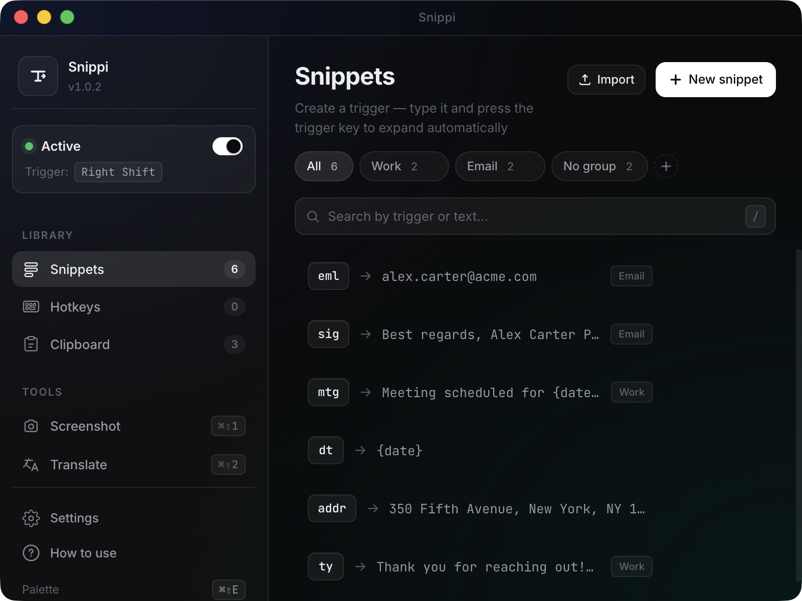

<div align="center">



# Snippi

**Cross-platform text expander with OCR and screen translation**

*Кроссплатформенный текст-экспандер с распознаванием и переводом со скриншота*

[](https://github.com/woler1337/snippi/releases/latest)
[](https://github.com/woler1337/snippi/releases)
[](LICENSE)
[](#-download--скачать)
[](https://github.com/woler1337/snippi/stargazers)

[Website](https://snippiapp.com/) ·
[Download](https://github.com/woler1337/snippi/releases/latest) ·
[Privacy](https://snippiapp.com/privacy.html) ·
[Issues](https://github.com/woler1337/snippi/issues)


> ⚠️ **Work in progress / Pre-release.** Snippi is in active development. The app
> works, but expect rough edges, occasional bugs, and breaking changes between
> versions until v1.x stabilizes. Use at your own risk.
>
> *Snippi находится в активной разработке. Приложение работает, но возможны
> шероховатости и баги. Используйте на свой страх и риск.*



</div>

---

## 📥 Download / Скачать

Pick the file for your system on the **[Releases page](https://github.com/woler1337/snippi/releases/latest)**:

| Platform | File | Architecture |
|-----------|------|-------------|
| 🍎 **macOS** (Apple Silicon — M1/M2/M3/M4) | `Snippi-X.Y.Z-arm64.dmg` | arm64 |
| 🍎 **macOS** (Intel) | `Snippi-X.Y.Z.dmg` | x64 |
| 🪟 **Windows** (10 / 11) | `Snippi-X.Y.Z-portable.exe` | x64 |

> Not sure which one? On macOS: Apple menu → "About This Mac" → look for the chip (Apple M-series → arm64; Intel → x64).
> **Не уверены какой нужен?** На macOS — меню Apple → «Об этом Mac» → смотрите чип.

📖 **Detailed installation guide / Подробная инструкция:** [INSTALL.md](INSTALL.md)

---

## ✨ Features / Возможности

<table>
<tr><td>

### 🇬🇧 English

- **Snippets** — short triggers (`gm`, `eml`) expand into long text on a trigger key (Tab / Right Shift / Caps Lock / F1–F12)
- **Dynamic placeholders** — `{date}`, `{date:+7d}`, `{clipboard}`, `{uuid}`, `{random:1-100}`, `{upper:…}`, `{|}` cursor
- **Global hotkeys** — bind any key combo to insert any text
- **Snippet groups** — organize by context (work, personal, templates)
- **Screenshot → text (OCR)** — select an area, recognized text goes to clipboard. Apple Vision on macOS, Tesseract on Windows. Fully offline.
- **Screenshot → translate** — same as above + auto-translate to your target language (~80 languages, no API key)
- **Quick-search palette** — `⌘⇧E` / `Ctrl+Shift+E` opens fuzzy search across your snippets, like Raycast/Alfred
- **Clipboard history** — last 50 copied texts
- **Emoji pack** — 1-click install of 180+ `:smile:`-style snippets
- **Stats** — expansion count, time and characters saved
- **Auto-launch, dark theme, import/export, multilingual UI (en/ru/de)**

</td><td>

### 🇷🇺 По-русски

- **Сниппеты** — короткие триггеры (`gm`, `eml`) автоматически раскрываются по нажатию триггер-клавиши (Tab / Right Shift / Caps Lock / F1–F12)
- **Динамические плейсхолдеры** — `{date}`, `{date:+7d}`, `{clipboard}`, `{uuid}`, `{random:1-100}`, `{upper:…}`, `{|}` курсор
- **Глобальные хоткеи** — назначайте произвольной комбинации вставку любого текста
- **Группы сниппетов** — сортируйте по контексту (работа, личное, шаблоны)
- **Скриншот → текст (OCR)** — выделите область, текст из неё распознаётся и копируется в буфер. Apple Vision (mac), Tesseract (Windows). Полностью офлайн.
- **Скриншот → перевод** — то же + автоперевод на выбранный язык (~80 языков, без API-ключа)
- **Палитра быстрого поиска** — `⌘⇧E` / `Ctrl+Shift+E` открывает fuzzy-поиск как в Raycast/Alfred
- **История буфера обмена** — последние 50 скопированных текстов
- **Emoji-пак** — установка 180+ сниппетов вида `:smile:` в один клик
- **Статистика** — сколько раз сработали, сколько символов сэкономлено
- **Автозапуск, тёмная тема, импорт/экспорт, мультиязычный UI (en/ru/de)**

</td></tr>
</table>

---

## ⌨️ Default hotkeys / Хоткеи по умолчанию

| Action / Действие | Hotkey |
| ------ | ------ |
| Expand snippet / Раскрыть сниппет | Trigger key (default **Right Shift**) after typing the trigger |
| Screenshot → text / Скриншот → текст | `⌘⇧1` (macOS) / `Ctrl+Shift+1` |
| Screenshot → translate / Скриншот → перевод | `⌘⇧2` (macOS) / `Ctrl+Shift+2` |
| Quick palette / Палитра поиска | `⌘⇧E` (macOS) / `Ctrl+Shift+E` |

All hotkeys are customizable in app settings. / Все хоткеи меняются в Настройках.

---

## 🔒 Privacy / Конфиденциальность

- **All data stays on your device** — `~/Library/Application Support/snippi/` (macOS), `%APPDATA%/snippi/` (Windows)
- **OCR works fully offline** — screenshots are never uploaded
- **Translation** uses [MyMemory API](https://mymemory.translated.net/) — free public service, no API key, ~1000 chars/day per IP. Only recognized text is sent; screenshots are NOT uploaded.
- **No telemetry by default.** Optional opt-in crash reporting via Sentry (off by default, full details in [Privacy Policy](https://snippiapp.com/privacy.html))
- **MIT-licensed open source** — verify everything yourself

Full details: [Privacy Policy](https://snippiapp.com/privacy.html) · [Terms](https://snippiapp.com/terms.html)

---

## 🛠 Build from source / Запуск из исходников

```bash
git clone https://github.com/woler1337/snippi.git
cd snippi
npm install
npm start              # dev mode
npm run build:mac      # DMG (macOS, x64 + arm64)
npm run build:win      # portable .exe (Windows)
```

Releases are built automatically by [GitHub Actions](.github/workflows/release.yml) on every `v*` tag. See [.github/RELEASE.md](.github/RELEASE.md).

### Stack

- **Electron 42**, `electron-store`, `electron-log`, `electron-updater`
- **uiohook-napi** — global keyboard interception
- **tesseract.js** — OCR on Windows
- **franc-min** — language detection for the translator
- **MyMemory Translation API** — free translator
- **Swift helpers** on macOS (`key-helper`, `ocr-helper`) — native key emulation + Vision-based OCR

### Project structure / Структура

```
src/
├── main/                  # Main process (10+ modules)
│   ├── main.js            # Entry point, lifecycle
│   ├── tray.js            # Menu bar icon
│   ├── mainWindow.js      # Main window
│   ├── snip.js            # Area selector + OCR + translate
│   ├── palette.js         # Quick search palette
│   ├── hotkeys.js         # Global hotkeys
│   ├── ipc.js             # All ipcMain.handle's
│   ├── expander.js        # Keyboard interception
│   ├── placeholders.js    # {date}/{clip}/{uuid}/… engine
│   ├── updater.js         # Auto-updates via GitHub Releases
│   ├── sentry.js          # Opt-in crash reporting
│   ├── emoji-pack.js      # 180+ emoji snippets
│   ├── i18n.js            # Main-side translations
│   └── ocr.js, translator.js, storage.js, stats.js, …
├── renderer/              # UI (vanilla HTML/CSS/JS)
│   ├── index.html, app.js, styles.css, i18n.js
│   ├── snip.*             # Area selection overlay
│   └── palette.*          # Quick-search palette
└── native/                # Swift helpers for macOS
```

---

## 📝 License / Лицензия

[MIT](LICENSE) © 2026 Daniil Limarenkov

<div align="center">

⭐ **Like Snippi? Give it a star — helps a lot!** ⭐

</div>
